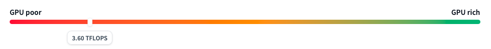
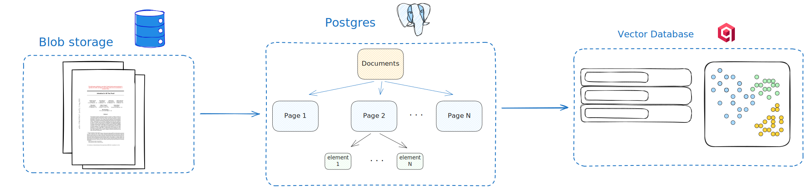
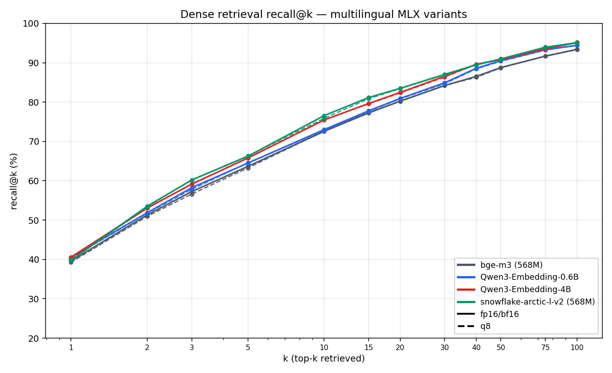
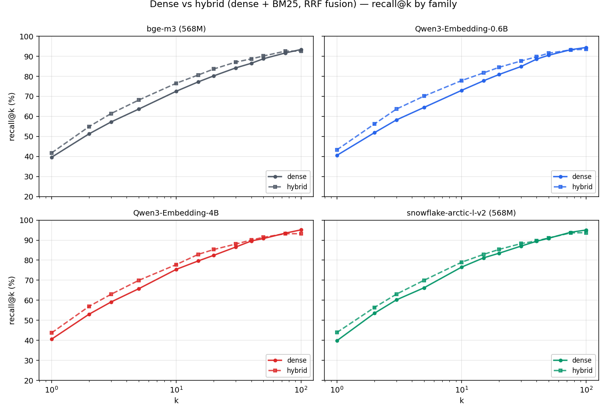
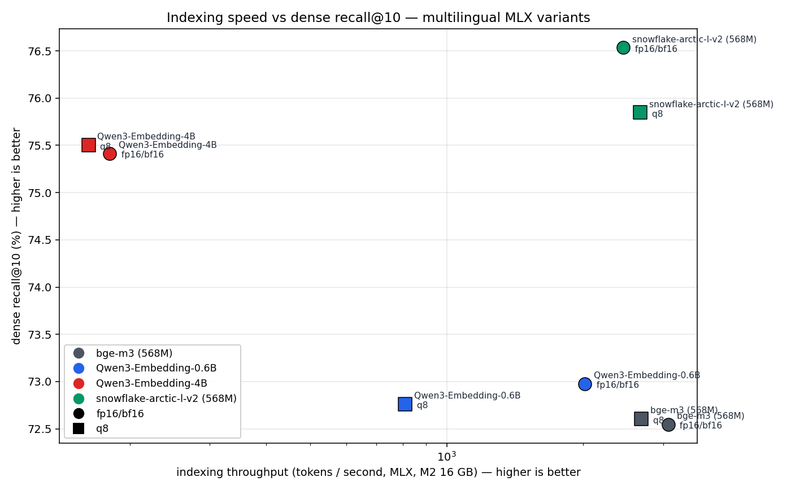
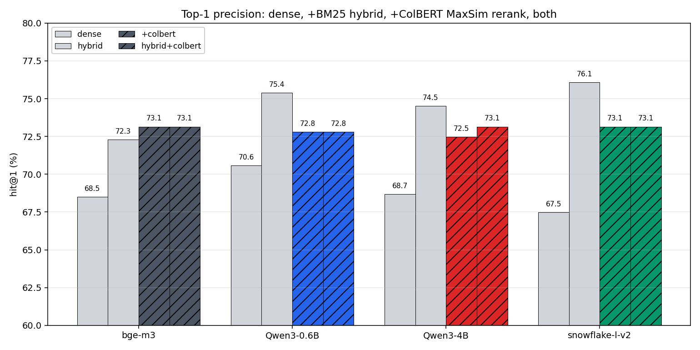

This is a post about building a grounded RAG system from scratch. The
goal is simple to state: point it at a stack of PDFs, ask a question
in natural language, get back an answer together with the exact
bounding box on the exact page that answer came from. The constraint
is what makes it interesting. The whole thing has to run on the laptop
I'm writing on, a MacBook Pro M2 with 16 GB of unified memory, no
cloud GPU.

The post starts from the simplest version of the pipeline that hits
the goal, then iterates from there. Each iteration is its own
subsection, with the reasoning, the numbers, and a link to whatever
code or model weights came out of it.

## Grounded, Fast, Efficient

Three goals, easy to state.

**Grounded.** Every answer has to point back to the bounding box on
the page it came from. Not a citation in plain text, a visible region
on the rendered page, one you can click on and verify.

**Fast.** Sub-second retrieval on a single query. Anything slower
turns iteration into a chore, and this is a system meant to be
iterated on a lot.

**Efficient.** Fits in 16 GB. Runs alongside a browser, an editor,
and the Docker stack the system itself depends on. No cloud GPU, no
API key billed by the token. The whole thing needs to be self-contained
enough that someone could clone the repo and have it work.

## The stack

Anything we want to retrieve later, we have to store first. The
system has three layers underneath: the binary files that come in,
the structured representation we extract from them, and the vector
index we build on top to make them searchable.

**Document storage.** PDFs land in a blob store keyed by a UUID.
Local case is just a directory; behind a thin
[fsspec](https://github.com/fsspec/filesystem_spec) wrapper so the
day this needs to live in S3 instead, the change is a config swap.

**The structured database.** A document has pages, each page has
layout elements (paragraphs, headings, tables, figures, formulas,
code blocks), and each element has one or more bounding boxes. That
hierarchy lives in [Postgres](https://www.postgresql.org/) via
[SQLAlchemy](https://www.sqlalchemy.org/). On top of the elements
come **chunks**, the unit the embedder sees and retrieval returns.
Each chunk keeps a link back to the elements it covers, so a hit can
be traced to specific page regions.

**The vector store.** One vector per chunk, in
[Qdrant](https://qdrant.tech/), keyed by chunk UUID, with a small
payload (just the parent document id, for filtering). Everything else
stays in Postgres.

**The embedder.** Starting point is
[bge-m3](https://huggingface.co/BAAI/bge-m3): 1024-dimensional
vectors, ~1.1 GB resident at fp16 on Apple Silicon, a defensible
default for general-purpose retrieval.

The parser is where the real work begins, and that's where the rest
of this post lives.

## The parsing

[Docling](https://github.com/docling-project/docling) is the tool we
use to turn a PDF into a structured tree. That tree is the input to
everything that follows: chunking, embedding, retrieval, grounding.
It controls what each later stage can see. So before we build any of
that on top, we should know how the parsing actually behaves on our
corpus, what it costs, and whether the defaults are the right ones.

### Two routes Docling offers

Docling exposes two top-level ways to turn a page into structured
content.

The first is the **traditional pipeline**: a layered stack of small
specialist models running in sequence. A CNN layout detector finds
text blocks, tables, pictures, formulas, and code. A separate model
parses table structure into rows and columns. A small
vision-language model runs on cropped code and formula regions to
turn them into LaTeX or source text. A figure classifier labels
pictures by type. The text inside each block comes from the PDF's
own text layer, extracted by a dedicated parser. Each stage has one
job, runs on one slice of the page, and produces one piece of the
final document.

The second is the **VLM pipeline**: one large vision-language model
gets the rendered page image and emits the entire structured
document for that page in one shot. No separate layout step. No
separate table parsing. The model decides where the text blocks are,
where the tables are, what the cells contain, which regions are
pictures, all at once. The Docling-blessed model for this path is
[Granite-Docling-258M](https://huggingface.co/ibm-granite/granite-docling-258M),
available as an MLX export for Apple Silicon.

Both routes produce a structurally similar `DoclingDocument`, and
Docling lets us swap between them by changing a single configuration
object.

### What each route costs on our corpus

Seven research papers, 155 pages total. Each variant runs each PDF
once untimed (warmup) then three times measured; we report the
median wall time per variant per doc, summed across the corpus. All
on Apple Silicon. Code:
[`benchmark/pdf_pipeline/`](https://github.com/leonnoirclerc/rag/tree/d72e8993f047c6b559062edfb7e5156299e8f33c/benchmark/pdf_pipeline).

| Variant | Total wall (s) | Per-page (s) |
|---|---:|---:|
| traditional | 582.4 | 3.8 |
| VLM (Granite-Docling-258M MLX) | ~2 000 | ~13 |

Roughly one order of magnitude. The traditional pipeline does cheap
text extraction on the bulk of the page (the prose, where the PDF
already has a clean text layer) and saves the expensive VLM passes
for the few regions that genuinely need them: the cropped code and
formula boxes. The VLM pipeline pays the full VLM cost on every page
to re-derive content that is already sitting in the PDF text stream.
For our corpus, which is born-digital papers with clean text layers,
the traditional pipeline is the right trade.

### Inside the traditional pipeline

The traditional pipeline is a pipeline in the literal sense: pages
stream through ordered stages, with multiple pages in different
stages at once. Each stage owns one piece of the page-to-document
translation, and each one is a place we can attack independently.

| Stage | What it does | Implementation |
|---|---|---|
| `page_parse` | Render the page to an image at two scales, extract text cells with bboxes from the PDF text layer | pypdfium2 (C++) for rendering, [docling-parse](https://github.com/docling-project/docling-parse) (C++) for text extraction |
| `layout` | Detect text blocks, tables, pictures, formulas, code regions on the rendered page | Object-detection CNN running on MPS |
| `table_structure` | Parse the cell grid of each detected table | TableFormer V1, CPU on Apple Silicon |
| `doc_enrich` | Crop each detected code or formula region and run a VLM on it to get LaTeX or source | Granite-Docling-258M, MLX |
| `reading_order` | Decide the order in which elements appear in the final document | CPU heuristics |
| `doc_assemble` | Build the final `DoclingDocument` tree | Pure Python |

Picture classification piggybacks on `doc_enrich`. Tables are a
stage of their own. Code and math sit inside `doc_enrich` because
they share the same VLM and the same per-region inference path.

### Where is the bottleneck?

Per-page wall time across the corpus, with tables on:

| Stage | Per-page wall (ms) |
|---|---:|
| `page_parse` | 500 |
| `layout` | 497 |
| `table_structure` | 544 |
| `doc_enrich` | **2 936** |

`doc_enrich` dominates the average. But the average hides the most
useful fact: the bottleneck depends on the document. Per-page wall
time, split per paper:

| PDF | Pages | Wall (s/page) | `doc_enrich` (s/page) | doc_enrich / wall |
|---|---:|---:|---:|---:|
| 01_attention_is_all_you_need.pdf | 15 | 1.27 | 0.63 | 50% |
| 02_mistral_7b.pdf | 9 | 0.79 | 0.09 | 12% |
| 03_mixtral_8x7b.pdf | 13 | 1.42 | 0.52 | 37% |
| 04_qjl.pdf | 13 | 4.81 | **3.85** | 80% |
| 05_polarquant.pdf | 22 | 8.72 | **7.97** | 91% |
| 06_turboquant.pdf | 25 | 6.36 | **5.39** | 85% |
| 07_deepseek_v4.pdf | 58 | 2.15 | 1.34 | 62% |

A page of mistral costs 90 ms in `doc_enrich`. A page of polarquant
costs 8 seconds. Two orders of magnitude. The reason is what the
layout step finds on each page: very few formulas in the text-heavy
papers, dozens of code and formula crops per page in the
quantization papers. That spread is what makes a corpus-wide "where
do I optimise" question deceptive: optimising the rendering backend
would barely move polarquant, and optimising the formula VLM would
barely move mistral. We attack the stage that dominates the
documents that matter. For us, that's the math-heavy papers, and
that means the code and formula VLM is the first place to look.

### First improvement: the code & formula model

`doc_enrich` is a per-region VLM inference. Every code block and
every math formula the layout step detects gets cropped from the
rendered page and sent through a vision-language model that emits
the LaTeX (for formulas) or source text with a language tag (for
code). On the math-heavy papers there can be dozens of these per
page. The VLM is what the stage is.

#### Two models for the job

Two candidates exist for this slot. The default is
[Granite-Docling-258M](https://huggingface.co/ibm-granite/granite-docling-258M),
the same general-purpose document VLM that also powers Docling's
full-page VLM pipeline. The natural specialist is
[CodeFormulaV2](https://huggingface.co/docling-project/CodeFormulaV2),
purpose-built for crop-level transcription and trained on millions
of code and formula images. They are similar in size (~300 M
parameters). Docling's
[model catalog](https://docling-project.github.io/docling/usage/model_catalog/#inference-engines-by-model-family)
lists CodeFormulaV2 as the recommended option for the code/formula
stage. The catch is in the same table: CodeFormulaV2's supported
inference engines are **CPU / CUDA / XPU**. There is no MLX entry.

#### Porting CodeFormulaV2 to MLX

CodeFormulaV2 is an
[Idefics3](https://huggingface.co/HuggingFaceM4/Idefics3-8B-Llama3)
finetune, and Idefics3 is already a first-class architecture in
[Blaizzy/mlx-vlm](https://github.com/Blaizzy/mlx-vlm). So the work
is a weight conversion plus a small contribution that registers
CodeFormulaV2 as a supported target of the existing `idefics3`
runtime. Three quantised variants are published:

- [`mlx-community/CodeFormulaV2-mlx-bf16`](https://huggingface.co/mlx-community/CodeFormulaV2-mlx-bf16)
- [`mlx-community/CodeFormulaV2-mlx-q8`](https://huggingface.co/mlx-community/CodeFormulaV2-mlx-q8)
- [`mlx-community/CodeFormulaV2-mlx-q4`](https://huggingface.co/mlx-community/CodeFormulaV2-mlx-q4)

#### CPU vs MLX

Three formula crops harvested from a page of `polarquant.pdf`, run
through CodeFormulaV2 on both backends with greedy decode, identical
inputs, two timed runs each:

| Crop | Output | CPU torch (s) | MLX bf16 (s) | Speedup |
|---|---|---:|---:|---:|
| short formula | 19 tokens | 2.06 / 2.18 | 0.89 / 0.89 | ~2.3× |
| medium formula | 151 tokens | 4.93 / 4.86 | 1.70 / 1.68 | ~2.9× |
| medium formula | 124 tokens | 4.30 / 4.29 | 1.55 / 1.52 | ~2.8× |
| **median** |  | **4.30** | **1.54** | **2.8×** |

Per crop, MLX is roughly 2.8× faster. The gap compounds across the
math-heavy papers, where a single page can carry dozens of code and
formula crops; across the full corpus on the MLX path, `doc_enrich`
costs 269 seconds out of 329 seconds total wall.

Per-page `doc_enrich` cost on the math-heavy papers, MLX:

| PDF | Pages | `doc_enrich` (s/page) |
|---|---:|---:|
| 04_qjl.pdf | 13 | 2.68 |
| 05_polarquant.pdf | 22 | 4.77 |
| 06_turboquant.pdf | 25 | 2.65 |
| 07_deepseek_v4.pdf | 58 | 0.82 |

The model the catalog actually recommends is now available to the
laptop user, on the hardware the laptop has.

### Second improvement: the layout detector

The `layout` stage uses
[`docling-layout-heron`](https://huggingface.co/docling-project/docling-layout-heron),
an RT-DETRv2 object detector. Docling runs it on MPS through
PyTorch. We ported RT-DETRv2 to MLX in
[mlx-vlm PR #1195](https://github.com/Blaizzy/mlx-vlm/pull/1195), with
the bf16 weights published at:

- [`mlx-community/docling-layout-heron-mlx-bf16`](https://huggingface.co/mlx-community/docling-layout-heron-mlx-bf16)
- [`mlx-community/docling-layout-heron-101-mlx-bf16`](https://huggingface.co/mlx-community/docling-layout-heron-101-mlx-bf16).

Full-corpus layout inference, 155 pages, median of 3 measured loops
per PDF:

| Backend | Corpus wall (s) | Per-page (s) |
|---|---:|---:|
| PyTorch on MPS (Docling default) | 39.20 | 0.253 |
| **MLX bf16 (this port)** | **27.78** | **0.179** |

About 1.4× faster on the same model, same corpus, same hardware.
End-to-end, the layout stage is a small fraction of total wall
(`doc_enrich` still dominates), so this iteration moves the corpus
number by only a few seconds. The win is real but local; we keep it
because the change is mechanical and the port lives in mlx-vlm anyway.

### Results

The two iterations together, CodeFormulaV2 on MLX for `doc_enrich` and
RT-DETRv2 on MLX for `layout`, change the parsing budget on the same
corpus, same hardware, same papers. Per-stage corpus totals (s),
comparing the CPU path Docling's catalog recommends (no MLX engine
exists today for CodeFormulaV2 on Apple Silicon) to the same pipeline
with our two ports plugged in:

| Stage | CPU baseline | + MLX ports (this work) |
|---|---:|---:|
| `page_parse` | 30.2 | 34.1 |
| `layout` | 70.6 | **32.1** |
| `doc_enrich` | **6 479.6** | **260.5** |
| `doc_assemble` | 1.0 | 0.7 |
| `reading_order` | 0.6 | 0.3 |

`doc_enrich` is the entire story: 6 480 s drops to 260 s, a 24.9×
shrink on the stage that owns 99 % of the CPU baseline. The layout
port adds a 2.2× speedup on its own stage. The other stages are
unchanged Docling code.

Corpus-wide:

| Pipeline configuration | Total wall | Per-page (s) | Speedup |
|---|---:|---:|---:|
| CodeFormulaV2 on CPU (Docling catalog recommendation) | **6 556 s** (1 h 49 m) | 42.3 | 1.0× |
| CodeFormulaV2 MLX + RT-DETRv2 MLX (this work) | **301 s** (5 min) | 1.94 | **21.8×** |

From 1 h 49 m to 5 minutes on the same laptop, same papers, same
model recommended by Docling's catalog. What lands in Postgres at the
end of it is the same `DoclingDocument` tree, with the same bounding
boxes, ready for the next chapter: chunking and the embedder.

## The embedding

The parser produces paragraph-anchored chunks. The embedder turns those
chunks (and the user's questions) into the vectors a similarity search
will compare. The choice anchors everything downstream, so it is worth
settling now, before we touch hybrid retrieval or reranking.

The usual framing is "pick the highest-scoring model on MTEB and move on".
For this project, three project-specific criteria sit above leaderboard
position.

**Multilingual.** The corpus is mostly English today, but the system
should accept French papers and French questions without rebuilding the
index. That rules out most of the small-and-fast end of the leaderboard.

**Sub-1B parameters.** The pipeline already
holds the parser, the layout detector, the formula VLM, and Qdrant
resident. The embedder coexists with those on a 16 GB laptop. 7B and 8B
models are out.

**Recall@k matters most at this stage.** The
retriever in this chapter is the first stage of a pipeline that will get
a sparse-search leg (BM25 with RRF fusion) and a late-interaction
reranker over the top-k. Both of those add precision back at the top of
the ranking. What they cannot do is rescue a paragraph the dense
retriever never returned. The metric to optimise here is *"did the
relevant paragraph make it into the top-k candidate pool I will hand to
the next stage?"* That is recall@k.

### The candidates models

Four multilingual families, each in native precision (fp16 or bf16) and
in 8-bit weight quantisation. All four run on Apple Silicon through
[`mlx-embeddings`](https://github.com/Blaizzy/mlx-embeddings). None of
them required new MLX model code: the CLS-pooling dispatch we used
to need a local patch for is
[merged upstream](https://github.com/Blaizzy/mlx-embeddings/pull/61)
now.

| Family | Params | Architecture | Notes |
|---|---:|---|---|
| [bge-m3](https://huggingface.co/BAAI/bge-m3) | 568 M | XLM-RoBERTa-large | 100+ languages, CLS-pooled. |
| [Qwen3-Embedding-0.6B](https://huggingface.co/Qwen/Qwen3-Embedding-0.6B) | 600 M | Qwen3 decoder | Last-token pooling, asymmetric (query prompt). |
| [Qwen3-Embedding-4B](https://huggingface.co/Qwen/Qwen3-Embedding-4B) | 4 000 M | Qwen3 decoder | Same family, 6.7× the parameters. Top of our size envelope. |
| [snowflake-arctic-embed-l-v2.0](https://huggingface.co/Snowflake/snowflake-arctic-embed-l-v2.0) | 568 M | XLM-RoBERTa-large | 74 languages, CLS-pooled. |

### Dense recall@k

Benchmark: 581 questions, exact ANN search (brute-force cosine, no HNSW), the layout-anchored ground truth from earlier in the post,
k=100 retrieved per question. Code:
[`eval/`](https://github.com/leonnoirclerc/rag/tree/main/eval).

`Snowflake-arctic-embed-l-v2.0` leads at every k from 3 to 100.`Qwen3-4B`
sits 1-2 recall points below it through k=10 to k=50. `Qwen3-0.6B` and
`bge-m3` are tied with each other and trail the leaders by 4-5 points
at k=10. The q8 (dashed) lines track the full-precision ones within
0.5-1 recall point everywhere.

We chose to keep `Snowflake-arctic-embed-l-v2.0`.

### Hybrid retrieval

Hybrid retrieval is the next chapter, but the embedder pick should hold
up under both modes, so a preview is useful here.

Recall@10 with the BM25 leg added:

| family | dense r@10 | hybrid r@10 | lift |
|---|---:|---:|---:|
| bge-m3 | 72.5 % | 76.5 % | +4.0 |
| Qwen3-0.6B | 72.9 % | 77.8 % | +4.9 |
| Qwen3-4B | 75.4 % | 77.7 % | +2.3 |
| snowflake-arctic-l-v2 | 76.5 % | 78.9 % | +2.4 |

Hybrid lifts every family, and lifts the weaker dense retrievers more.
The rank order across families is unchanged
after fusion. The embedder choice is robust to retrieval mode.

We keep `Snowflake-arctic-embed-l-v2.0` with BM25 hybrid search

### Quantization

A 568 M model in bf16 is 1.1 GB on disk. The q8 version is 576 MB. On
a 16 GB machine where the pipeline already holds the rest of the pipeline, halving the embedder's memory
footprint is real headroom.

The recall cost at k=10 is at most 0.7 points across the four families,
and closes to nothing by k=50. Quality-wise, q8 is free.

We chose `Snowflake-arctic-embed-l-v2.0` quantized to 8 bits with BM25 hybrid search.

### Indexing speed

The 568 M and 600 M models index in well under a minute for the
581-paragraph corpus (800-3000 tokens/second, depending on family and
precision). `Qwen3-4B` is roughly 10× slower (~180 tokens/second; about
six minutes to re-index the corpus). At the 100k-paragraph scale a
real-world corpus would have, that is the difference between an embed
step that takes a few minutes and one that takes an hour.

q8 is not uniformly faster than full precision on MLX. It is faster for
`Snowflake` (1.1×), slightly slower for `bge-m3` and `Qwen3-4B`, and
noticeably slower for` Qwen3-0.6B` (2.5× slower). The gap depends on
which architecture has a fully-vectorised dequantisation path in
`mlx-embeddings` at this version, and is the kind of thing that closes
upstream as more families get tuned. For now: treat q8 as a memory and
disk win, not a speed win.

The cleanest Pareto point on the chart is `snowflake-arctic-l-v2 q8`:
best recall@10 of any sub-1B variant, fastest throughput of any
sub-1B variant.

### The pick

**snowflake-arctic-embed-l-v2.0, q8.** Tops dense recall at every k
tested, tops hybrid recall too, shares the 568 M size class with `bge-m3`,
and the q8 quantisation gives us a 576 MB on-disk footprint with no
big quality cost.

## Reranking

The next logical step after hybrid retrieval is **reranking**: take the
top-K candidates from the prefetch and re-score them with a more
expensive but more accurate model. The usual reranker family is the
cross-encoder. One model, taking a (query, document) pair, emits a
relevance score. The catch is cost. A cross-encoder makes one full
forward pass per candidate, and competitive multilingual cross-encoders
are 500M+ parameters. With top-K=50, that is 50 forwards through a
heavy model per query. Our latency budget is sub-second total; a
cross-encoder rerank alone would blow that.

**Late-interaction (ColBERT-style) reranking** offers a different
trade-off. Each document is encoded once into a sequence of per-token
vectors at index time and stored on disk. At query time, the query is
encoded the same way, and the score is a cheap MaxSim aggregation over
per-token similarities. The work the cross-encoder pays per-pair at
query time is amortised at index time, paid once per document. The
model size is similar but the per-query cost drops from "K model
forwards" to "1 model forward + K small dot-product reductions". That
shape fits the latency budget. It is also why we already configured the
late-interaction multi-vector field in Qdrant earlier in the post.

### The multilingual options

We considered two multilingual late-interaction models:

- [`jinaai/jina-colbert-v2`](https://huggingface.co/jinaai/jina-colbert-v2):
  559 M parameters, 94 languages, 128-dim per-token vectors.
- [BAAI/bge-m3 multivector head](https://huggingface.co/BAAI/bge-m3):
  the same bge-m3 we already load for dense, with its multi-vector head
  applied to per-token outputs. 1024-dim per token, eight times the
  storage and the MaxSim compute of jina. It is not Matryoshka-trained,
  so naively truncating to a comparable 128-d would discard most of the
  signal in unprincipled ways.

We picked **jina-colbert-v2**: native low dim, training designed for
the task, and the multilingual coverage is strictly broader than
bge-m3's.

We ported jina-colbert-v2 to MLX
([`src/rag/embedding/colbert.py`](https://github.com/leonnoirclerc/rag/blob/main/src/rag/embedding/colbert.py))
on top of the same `xlm-roberta-rope` backbone we vendored from
mlx-vlm. Storage trick: the multi-vector field in Qdrant has HNSW
disabled (`hnsw_config.m=0`) and lives on disk. It is only ever scored
exact-MaxSim against the candidates the prefetch returns, so building a
graph would be wasted work.

### Hit@1 across the four multilingual families

| family | dense | hybrid | +colbert | hybrid+colbert |
|---|---:|---:|---:|---:|
| snowflake-l-v2 | 67.5 | **76.1** | 73.1 | 73.1 |
| Qwen3-4B | 68.7 | **74.5** | 72.5 | 73.1 |
| Qwen3-0.6B | 70.6 | **75.4** | 72.8 | 72.8 |
| bge-m3 | 68.5 | 72.3 | **73.1** | 73.1 |

**jina-colbert-v2 does not improve our retrieval.** Hybrid alone wins
on three of four families. The one family where ColBERT helps (bge-m3)
gains less than a point. Stacking ColBERT on top of hybrid ties
"+ColBERT alone" in every family, which means the BM25 leg surfaces
candidates that ColBERT then deranks back. The two scoring systems
are not stacking; they are trading.

The full metric table on snowflake-l-v2 (our picked embedder):

| variant | hit@1 | hit@5 | hit@10 | recall@10 | mrr | ndcg@10 |
|---|---:|---:|---:|---:|---:|---:|
| hybrid (no rerank) | **73.8** | **92.5** | **96.2** | **78.9** | **82.1** | **71.6** |
| hybrid + ColBERT | 73.1 | 91.9 | 95.4 | 76.3 | 81.4 | 69.8 |

Two failure examples make the mechanism concrete. Both are queries
where snowflake-hybrid had the right paragraph at rank 1 and ColBERT
then demoted it.

> **Q:** *"What two-stage process does DeepSeek-V4-Flash follow when
> introducing sparse attention during training, and at what sequence
> length and token count is sparsity first activated?"*
>
> **Hybrid rank 1 (correct):** the training-recipe paragraph with the
> sparsity schedule and the token-count cutoffs.
>
> **ColBERT rank 1 (wrong):** the paper's abstract, which mentions
> "DeepSeek-V4-Flash", "sparse attention", and "training" multiple
> times but does not answer the specific question.
>
> Right answer demoted to rank 16.
>
> **Why ColBERT failed here.** The abstract has many tokens that match
> the query's topic words. MaxSim sums those matches, so the abstract
> scores high. The specific training paragraph mentions the same topic
> words fewer times and loses on token count, even though it actually
> contains the answer.

> **Q:** *"How are the authors of the DeepSeek-V4 paper listed, and
> what does the asterisk (*) notation next to certain author names
> indicate?"*
>
> **Hybrid rank 1 (correct):** the two-sentence answer, exactly:
> *"Authors are listed alphabetically by their first name. Names marked
> with * denote individuals who have departed from our team."*
>
> **ColBERT rank 1 (wrong):** an unrelated paragraph about
> Mixture-of-Experts architecture that happens to mention "DeepSeek-V4".
>
> Right answer demoted to rank 8.
>
> **Why ColBERT failed here.** The right answer is short, about 25
> tokens. MaxSim's score scales with the number of high-similarity doc
> tokens, so short answers are systematically under-scored. The long
> MoE paragraph wins on token count.

The pattern across the 41 cases where ColBERT demoted the right answer
is consistent: it rewards token-rich generic content; BM25's IDF
weighting rewards rare-word matches that pinpoint specific answers. On
a corpus of short technical paragraphs answering specific questions,
hybrid retrieval is the right tool. ColBERT was built for a different
corpus shape.

### What we ship

The retrieval pipeline stops at **dense + BM25 with RRF fusion**.
ColBERT MaxSim does not earn its keep on this corpus, and stacking it
on top of hybrid does not help in any family. We keep the MLX
`jina-colbert-v2` port in the codebase as a documented building block. If
the corpus later shifts to long documents or to an out-of-domain mix,
this is the obvious next thing to revisit.

---

**Code state at time of writing:** [`d72e899`](https://github.com/leonnoirclerc/rag/commit/d72e8993f047c6b559062edfb7e5156299e8f33c).
**Reproduce the parsing numbers:** `uv run python -m benchmark.pdf_pipeline --variants codeformulav2_mlx`.
**Reproduce the embedder + late-interaction sweeps:** `uv run python -m eval.sweep`.
